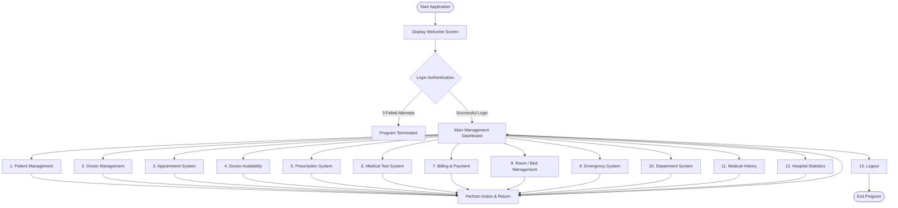

# Project Report: Hospital Management System

**Course / Project Title**: Hospital Management System  
**Language & Platform**: Java (JDK 21) | Object-Oriented Software Architecture  
**Author**: Fahad Sarker  
**Date**: September 2026  

---

## 1. Introduction

In modern healthcare administration, managing patient records, doctor availability, appointments, billing, medical history, and emergency care manually or using disconnected systems leads to operational bottlenecks, administrative errors, and compromised patient care. 

The **Hospital Management System (HMS)** is a modular, high-performance console application built using Core Java. The primary goal of this project is to streamline daily hospital operations by consolidating core management tasks into a centralized, structured, and user-friendly system.

### Objectives
- **Centralize Hospital Operations**: Provide a unified platform to track patients, doctors, appointments, lab tests, prescriptions, rooms, and billing.
- **Enforce Security**: Safeguard administrative features through a secure login authentication protocol with attempt tracking.
- **Apply Industry Architecture**: Structure the codebase using a Layered Architecture (Model-Repository-Service-UI-Util) rather than monolithic scripting.
- **Demonstrate OOP Principles**: Effectively incorporate all four fundamental pillars of Object-Oriented Programming: Encapsulation, Abstraction, Inheritance, and Polymorphism.

---

## 2. Flowchart & System Workflow

The following flowchart outlines the system control flow, starting from user authentication, navigating through the main dashboard menu, and interacting with specific subsystem modules.



---

## 3. Implementation & Screenshots

### 3.1 Software Architecture
The application is structured into five dedicated packages under `com.hospital`:

- **`com.hospital.model`**: Entity classes representing domain objects (`Person`, `Patient`, `Doctor`, `Appointment`, `Prescription`, `MedicalTest`, `Bill`, `Room`, `EmergencyPatient`, `Department`, `MedicalHistory`).
- **`com.hospital.repository`**: `HospitalDatabase` singleton managing in-memory collections (`ArrayList`) and auto-incrementing ID counters.
- **`com.hospital.service`**: Business logic classes handling CRUD operations, calculations, and rules. Includes `HospitalService` interface.
- **`com.hospital.ui`**: `MainMenu` managing console interaction and navigation submenus.
- **`com.hospital.util`**: Helper utilities for safe user input reading (`InputScanner`) and UI formatting (`ConsolePrinter`).

### 3.2 Object-Oriented Programming (OOP) Implementation

1. **Encapsulation**: Private fields across model entities accessed via public getter and setter methods.
2. **Abstraction**: Complex data filtering and validation logic are hidden inside service classes (`PatientService`, `BillingService`).
3. **Inheritance**: Base class `Person` contains shared fields (`id`, `name`, `phone`), which are inherited by `Patient` and `Doctor`:
   ```java
   public class Patient extends Person { ... }
   public class Doctor extends Person { ... }
   ```
4. **Polymorphism**: 
   - **Method Overriding**: `Person` defines `getDetails()`, overridden by `Patient` and `Doctor` to format specific details dynamically.
   - **Interface Implementation**: `PatientService` and `DoctorService` implement `HospitalService`.

---

### 3.3 Terminal Interface Screenshots & Execution Outputs

#### Screen 1: Welcome & Login System
Upon launching the system, the administrator is prompted for credentials.

```text
==============================================
       WELCOME TO HOSPITAL MANAGEMENT
==============================================

----------- LOGIN SYSTEM -----------
Username: admin
Password: ****

Login successful!
```

#### Screen 2: Main Dashboard Menu
After successful authentication, the main menu displays 13 operational options.

```text
==============================================
       HOSPITAL MANAGEMENT SYSTEM
==============================================
1. Patient Management
2. Doctor Management
3. Appointment Management
4. Doctor Availability
5. Prescription System
6. Medical Test System
7. Billing & Payment
8. Room/Bed Management
9. Emergency Patient
10. Department System
11. Medical History
12. Hospital Statistics
13. Logout
==============================================
Enter your choice: 1
```

#### Screen 3: Patient List Rendering (Polymorphic Output)
Viewing all registered patients displays formatted output generated polymorphically via `getDetails()`.

```text
----------- PATIENT LIST -----------
----------------------------------------------
ID: 1001 | Name: Rahim Ahmed | Phone: 01711111111 | Age: 25 | Gender: Male | Disease: Fever
----------------------------------------------
ID: 1002 | Name: Nusrat Jahan | Phone: 01822222222 | Age: 30 | Gender: Female | Disease: Diabetes
----------------------------------------------
ID: 1003 | Name: Milon Ahmed | Phone: 0183467892 | Age: 28 | Gender: Male | Disease: Ulcer
----------------------------------------------
ID: 1004 | Name: Fahim Ahmed | Phone: 0171125311 | Age: 22 | Gender: Male | Disease: Fever
```

#### Screen 4: Hospital Statistics & Financial Summary
Option 12 aggregates metrics across all subsystems into a report.

```text
==============================================
       HOSPITAL STATISTICS
==============================================
Total Patients       : 14
Total Doctors        : 14
Total Appointments   : 0
Active Appointments  : 0
Prescriptions        : 14
Medical Tests        : 0
Total Bills          : 0
Paid Bills           : 0
Total Income         : 0.0 BDT
Total Rooms/Beds     : 18
Available Beds       : 18
Emergency Patients   : 0
Departments          : 10
Medical Histories    : 0
==============================================
```

---

## 4. Conclusion

The **Healthcare Management System (HMS)** demonstrates how applying structured software design patterns transforms monolithic code into a clean, maintainable, and scalable application. 

By separating concerns into clear packages (`model`, `repository`, `service`, `ui`, `util`) and fully leveraging Object-Oriented Programming pillars (Encapsulation, Abstraction, Inheritance, and Polymorphism), the system ensures data integrity, ease of maintenance, and effortless extensibility for future enhancements (such as persistent database integration or graphical user interface development).
